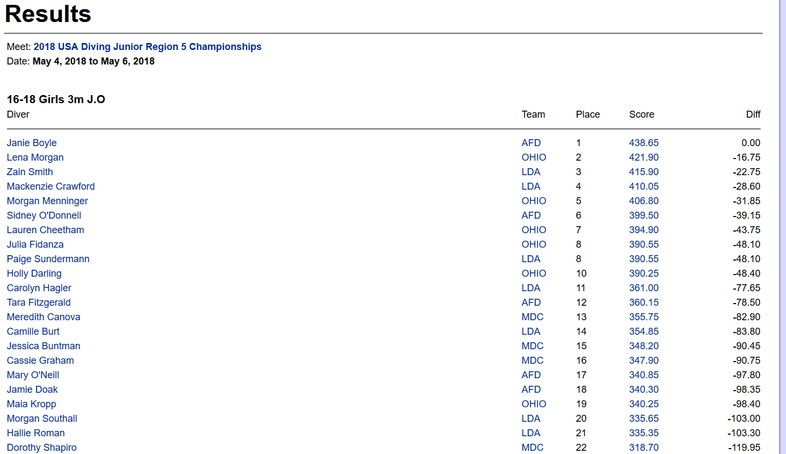

### **Data Collection (Part 1) to Test for Bias in Junior Diving Scores (Part 2)**
#### **Background:**
Many times, people sit in the stands, on the side lines, or in front of their TV watching a game, competition, or meet and think that a referee, official, or judge may have been biased in their calls or scores. Is it true? Are the officiants biased or are we just seeing things from our own biased view point?   
Bias can be very difficult to uncover. Two athletes behaving or performing in the same manner could have different outcomes. Is this really the result of bias or did the officiant legitimately not observe something from one athlete that was seen in the other, maybe because they were looking in a different direction? Improvements in technology has aided the analysis for many of these types of situations and allows some errant calls to be corrected, but still, the question persists.  
The bias we are going to consider here is affiliation bias. In order to determine if there is affiliation bias, you need to know if the officiant and the athlete have a common affiliation, most likely as part of the same team.  
We would like to know if this bias is evident at the children’s sports level. To determine this, you need to know the events that occurred, the resulting calls or scores, and the affiliation of the athlete and the officiant. This information needs to be readily accessible for a large number of events. Diving provides a very good resource for this type of information. The website divemeets.com has the results from most diving events in the country. It contains diver names, clubs, scores from each judge for the dives, judge’s names, and judge’s affiliations or clubs. The judges are usually coaches, from the teams attending the meets. There are occasional guest judges whose affiliation would be unknown, but these are a minority of the judges. There is also a progression of meets where placing high in one meet allows the diver to advance to the next higher-level meet. This would enhance the incentive for bias, if it were to exist. This is where we will start phase one of this project.  

#### **Project – Phase 1:**
This project contains two phases, the first is data collection and cleaning and the second phase is data interpretation and testing for bias. The minimum data required for bias testing includes a diver identifier, their associated team, their score from each judge/coach with the judge identified, and the judge/coach’s team. The meets we will look at are the advancement meets, which are the regional and zone meets. There are 12 regions and 6 zones in the USA resulting in 18 meets a year to be considered. Three years will be looked at, 2016, 2017, and 2018 resulting in 54 meets. This can all be queried on the divemeets.com page but there would be a query for each meet to get the list of results, then select the results category (age, gender, and board-1M, 3M, platform) – 24 categories, then select the score for a diver from that category – most have 30-40 divers, this shows a list of the dives where you then select the score for the individual dive which shows the judges names and the scores they gave, you then select the judge’s name and it shows the club they are with. The data is all there but it is on so many different pages that it would take a huge number of hours to pull it all together. The 2018 region 5 meet had 219 divers who competed in 509 events completing 4023 dives and obtaining 17752 scores. The following set of images shows the progression through the pages to gather the required information.  

Meet choices – select results under the meet: 

 
Some of the events – select each one: 

The results for one of the categories – select the score for a diver: 

The scoring results for this diver for this event – select the score for each dive: 

The scores for the individual dive and the judges giving that score –  

If on the page above, we select “all Scores for this Event” we can get the scores for each dive: 

Selecting the “All Divers Scores for this Event” produces a page with the above format for each diver competing in the event. Extracting information from this page would shorten the process considerably.   
Selecting a judge’s name from the above pages gives the judge’s profile which includes the USA diving team with which the judge is affiliated.  

The solution is to use web scraping to collect the information. Getting to the Results page shown above containing the scores for all divers in the event allows the collection of all the required except for the coach/judge team. All that is needed is a list of all the URLs for each of the results pages for each event in each meet. If all 24 events were competed at each of the 54 meets, there would be 1,296 URL’s in the list to be scraped.  
The URL’s were gathered for each of the results pages for each event in each meet resulting in the collection of 1178 URL’s since not all events were contested at each meet. It was discovered that there was a pattern to the URL’s making the building of the list easier. The URL looks like the following: 
https://secure.meetcontrol.com/divemeets/system/totaljudgesscoresext.php?meetnum=4141&eventnum=190&dvrnum=ALL&eventtype=9  
The meetnum is different for each of the 54 meets and the eventnum is unique for each of the events. There are 24 different events but there are actually 26 different possible event numbers since two of the events had a variation where some of the divers were cut/eliminated partway through the competition when the number of divers entered for the event was large. Once this pattern was discovered, the set of URL’s containing all the different event numbers could be copied, the meet number updated to the current meet, the events competed verified, and any events not competed could be removed. An input file named **divemeets_urls** was created containing the list of URL’s for the web scraping.  
Beautiful Soup was used for the web scraping. A test scraping was completed for three URL’s to examine the format of the pages returned in order to write the code needed to extract the desired information.   
The first set of code was generated in Jupyter notebooks **MSDS 692 WebScraping.ipynb** to collect the information from the scraped web page. This was tested on the three pages collected initially. The data collected was the meet name, meet date, event, diver and team as one variable, judge name, and up to eleven scores. This data was collected into a file **divemeets_data.csv** and written out/saved for further processing.  
The gathering of the judge/coach names and team affiliation into another file was the next step in the data collection process. The file created in the first step was opened as an excel file, renamed, all columns deleted except for the judge/coach name, and sorted for unique names. The judge names entered as “Judge” or “Unknown” or “Unattached” or any other substitution for an actual name were deleted. The remaining judge/coach names were all looked up by hand, the team affiliation was entered into the excel file, and the file was saved. The process could not be automated because there was too much variation in the coach profiles. Some coaches had multiple pages with only one containing usable information, some pages had multiple team affiliations for the judge/coach, some judges were previously divers so there were team affiliations as a diver and then as a coach, some had no team affiliations listed, as well as many other issues and inconsistencies with the judge/coach profiles. There was one difficulty where there were two judges listed in the scoring file with the same first and last name but a different middle initial. The dive meets coach/judge information pages did not contain the middle initial. The team websites for the teams for those coaches were searched to try to find which coach went with which team. The correct assignment was finally determined upon finding that one coach had an email address containing his middle initial. The judge and team affiliation information was compiled in to a file called **divemeets_judges.csv** There was a total of 457 named judges with 27 unattached and 60 unknown, leaving 380 judges with known affiliations.  
The data processing and data clean up was done in a Jupyter notebook titled **MSDS 692 Process Data.ipynb** The team affiliation for the judge/coach now needs to be checked against the team affiliation for the diver to determine of the diver and judge are from the same team or a different team. There is also a third category of unknown affiliation when the judge is not named or listed as unattached or unknown, or the diver is listed as unattached. In these cases, there is likely some level of affiliation with a team, but it cannot be determined from the provided information. The diver’s team needs to be compared to the judge/coach team and a flag should be set indicating if the diver and judge teams match (1), are different (0), or are unknown (2).   
The first step in the data processing is to separate the diver name from the diver team name so that the diver team and judge team can be compared. There is a dash between the diver name and team, so it is easy to just split the field on this, except one of the divers had a hyphenated last name. The delimitator was redefined to include a space on either side of the dash. This resolved the issue. Now the data file looked like this: 

 
Each line of the file was checked and if there was a valid judge name and the diver had a team name, the judge name was searched in the judge file and when found, the judge team was compared to the diver team. If the teams matched, the flag was set to 1, if the teams did not match, the flag was set to 0, and if there was no team listed for the judge/coach or the diver, the flag was set to 2. The data file now looked like this: 

The following contains counts for some of the information that will be used for the bias analysis:  
total records:	  226557     - how many records in the final file 
Total scores:  	  839842     - how many scores were recorded  
unique meets:  	  54         - how many meet results in file 
unique divers:    3572	     - different divers in file 
unique teams:  	  207	     - different teams in file 
unique judges:     473	     - different judges in file 
Total scores:  	  839842     - how many scores were recorded 
matching rows:  	 
* 0  = 172837 – non-matching team
* 1  =  15935 – diver and coach team match
* 2  =  37785 – diver or coach team unknown
Name: same, dtype: int64  

The results show a very unbalanced count of records where the diver and judge/coach teams are the same verses when the teams are different or one team is unknown. This was actually expected and the unbalance needs to be considered during the data analysis.  

The counts for the unique teams and judges includes “Unattached” and “Unknown” as well as other values filled in by meet personnel when the actual judge or team name is missing. The variables for the final output file **divemeets_final_data.csv** are as follows:  
* meet – character: name of the meet 
* date – character: the dates the meet took place 
* event – character: description of the event competed 
* judge – character: name of the judge giving the score 
* score1 – numeric: 0-10: judges score for the first dive competed 
* score2 – numeric: 0-10: judges score for the second dive competed 
* score3 – numeric: 0-10: judges score for the third dive competed 
* score4 – numeric: 0-10: judges score for the fourth dive competed 
* score5 – numeric: 0-10: judges score for the fifth dive competed 
* score6 – numeric: 0-10: judges score for the sixth dive competed 
* score7 – numeric: 0-10: judges score for the seventh dive competed 
* score8 – numeric: 0-10: judges score for the eighth dive competed 
* score9 – numeric: 0-10: judges score for the ninth dive competed 
* score10 – numeric: 0-10: judges score for the tenth dive competed 
* score11 – numeric: 0-10: judges score for the eleventh dive competed 
* diver – character: name of the diver competing 
* d_team – character: name of the team for which the diver is competing 
* same – numeric: 0,1,2: 0=diver and judge on different teams; 1=diver and judge on the same team; 2=either diver or judge team affiliation is unknown  
There are null values in the score fields. This is required as it indicates that either the dive was not competed, or the judge listed was not scoring that dive. The null values must be correctly handled when the data is processed. For proper analysis of bias, the scores must be attributed to the correct dive since for one of the possible tests for bias, they must be compared against other scores for the same dive. The nulls cannot be replaced with zero since zero is a valid score for a dive. Eleven dives are the maximum number of dives competed but not all divers perform eleven dives. Younger divers compete fewer dives.  

This is the process used to create the final output file: 

 
#### **Project – Phase 2** (to be completed later):
There are quite a few different ways we can look for bias. We have judges with affiliations scoring their own divers, judges with affiliations scoring other divers, and judges with no known affiliations scoring divers. We can look for bias at a macro level or at a micro level. For the macro level, we would take all the scores that all judges give to their own divers, find the average score and compare that to the average score all judges give to divers other than their own. We can look at each individual judge and compare the average of all the scores they gave to the overall average to see if any judges tend to score higher or lower than average for every diver. At a kind of intermediate level, we can look at all the records for a given coach and compare average score for an affiliated diver to scores they gave to other divers. At a micro level, we can look at each record with a diver/coach affiliation and compare that coach’s score for each of that diver’s dives to the scores given by the other judges to determine if there is a bias in the affiliated coach/judge scores. We can also separate the meets by meet level to see if there is bias at a region or zone level. We can look at specific regions or zones to see if there is bias at one that does not occur at others. We can also look at events to see if there is bias for particular events such as at the older level when college scholarships may be on the line.  
If there is no bias detected and there is no difference between scoring for affiliated and non-affiliated divers/coaches, then the analysis would be complete. If we do find that there is any bias, we can use the information to determine/predict if there are any affiliations in the unknown category where either a coach or diver has an unknown/unattached team. We could also web scraping for the 2019 data and see if affiliations can be detected there. 
